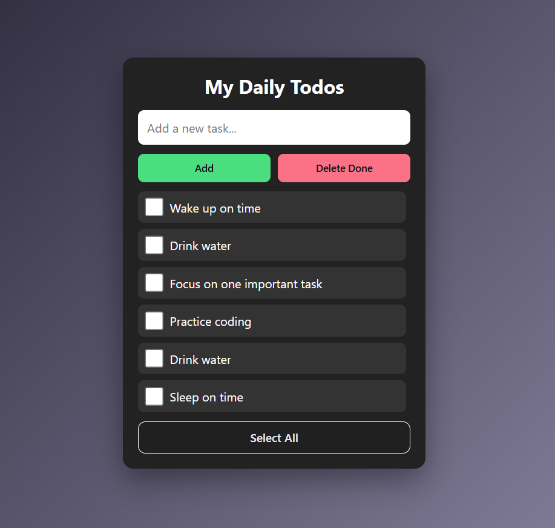

# 📝 My Daily To-Do App



A **simple, clean, and responsive To-Do List application** built with **HTML, CSS, and Vanilla JavaScript**.
Organize your daily tasks, mark them as done, and keep them saved even after closing the browser.

---

## 🌟 Features

* ✅ **Add tasks dynamically**
* ✅ **Delete completed tasks**
* ✅ **Select/Deselect all tasks at once**
* ✅ **Persistent storage** with `localStorage`
* ✅ **Responsive and mobile-first design**
* ✅ **Smooth hover effects** and subtle animations for better UX

---

## 📂 Project Structure

```
todo-app/
│
├── index.html     # Main HTML page
├── style.css      # Styling and responsive design
└── script.js      # Task management, event handling, and localStorage
```

---

## 💻 How It Works

1. **Add Task**

   * Type your task in the input box and click **Add**.

2. **Mark Task as Done**

   * Click the checkbox to mark a task as completed. Completed tasks get a **line-through effect**.

3. **Delete Completed Tasks**

   * Click **Delete Done** to remove all completed tasks.

4. **Select/Deselect All Tasks**

   * Click **Select All** to check/uncheck all tasks at once.

5. **Persistent Storage**

   * Tasks are saved in **localStorage**, so they remain after refreshing the page.

---

## 🎨 Technologies Used

| Technology | Purpose                                   |
| ---------- | ----------------------------------------- |
| HTML       | Structure of the app                      |
| CSS        | Styling, responsive layout, hover effects |
| JavaScript | Task management, events, and localStorage |

---

## 🚀 Getting Started

1. **Clone the repository**:

   ```bash
   git clone https://github.com/Shri-coder413/project-based-learning.git
   ```
2. **Navigate to the project folder**:

   ```bash
   cd project-based-learning/my-ToDo-app
   ```
3. **Open `index.html`** in your browser.
4. Start adding, completing, and deleting tasks!

---

## 🔗 Demo

[View Live Demo](https://shri-coder413.github.io/project-based-learning/my-ToDo-app/)

---

## 🖼️ Screenshot


---

## 💡 Future Improvements

* Add **priority levels** for tasks
* Add **dark mode** toggle
* Enable **task editing**
* Add **notifications/reminders**

---

## ❤️ Author

**Shrinivas Nakadi** – passionate about **web development** and creating simple yet effective web apps.
[GitHub](https://github.com/Shri-coder413) | [LinkedIn](https://www.linkedin.com/in/shrinivas-nakadi/)

---
